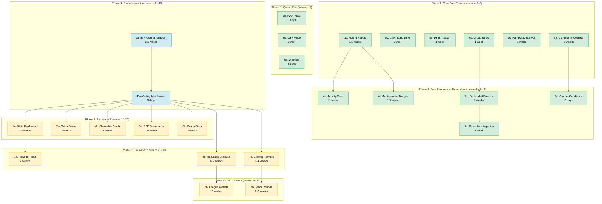
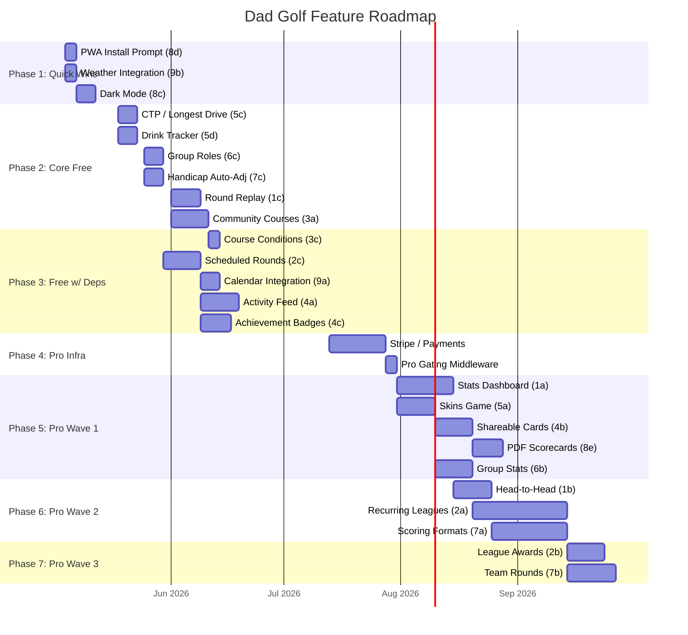

# Dad Golf Roadmap

Dependency graph and estimated durations for all FREE and PRO features.
Estimates assume a solo developer working part-time (~15-20 hrs/week).

---

## Dependency Graph



**Legend:** Green = FREE, Yellow = PRO, Blue = Infrastructure

---

## Gantt Timeline



---

## Phase Breakdown

### Phase 1: Quick Wins (Weeks 1-2)

| Feature | Duration | Depends On | Notes |
|---------|----------|------------|-------|
| 8d. PWA Install Prompt | 3 days | — | Manifest, service worker, install banner |
| 9b. Weather Integration | 3 days | — | Free API (Open-Meteo), show on round page |
| 8c. Dark Mode | 1 week | — | CSS variables, theme toggle, persist pref |

**Phase total: ~2 weeks**

Ship these immediately. Low risk, visible improvements, good momentum.

---

### Phase 2: Core Free Features (Weeks 3-8)

| Feature | Duration | Depends On | Notes |
|---------|----------|------------|-------|
| 5c. CTP / Longest Drive | 1 week | — | Flag on hole + claim field |
| 5d. Drink Tracker | 1 week | — | Simple ledger per round |
| 6c. Group Roles | 1 week | — | Role column + permission checks |
| 7c. Handicap Auto-Adj | 1 week | — | Rolling calc from recent scores |
| 1c. Round Replay | 1.5 weeks | — | Summary view, hole-by-hole breakdown |
| 3a. Community Courses | 2 weeks | — | Shared courses, search, basic moderation |

**Phase total: ~6 weeks** (some can run in parallel)

These are the features that make the free tier genuinely compelling.

---

### Phase 3: Free Features with Dependencies (Weeks 7-12)

| Feature | Duration | Depends On | Notes |
|---------|----------|------------|-------|
| 3c. Course Conditions | 3 days | 3a | Tags on community courses |
| 2c. Scheduled Rounds | 2 weeks | 6c | Date/time/course + RSVP |
| 9a. Calendar Integration | 1 week | 2c | .ics export + calendar API |
| 4a. Activity Feed | 2 weeks | 1c | Group round feed + likes |
| 4c. Achievement Badges | 1.5 weeks | 1c | Badge definitions + unlock logic |

**Phase total: ~5 weeks** (overlaps with late Phase 2)

Can start some of these before Phase 2 finishes since they only depend
on specific Phase 2 items.

---

### Phase 4: Pro Infrastructure (Weeks 11-13)

| Feature | Duration | Depends On | Notes |
|---------|----------|------------|-------|
| Stripe / Payment System | 2-3 weeks | — | Checkout, webhooks, subscription mgmt |
| Pro Gating Middleware | 3 days | Stripe | Server middleware + client UI gates |

**Phase total: ~3 weeks**

Must be solid before shipping any Pro features. Include subscription
management page, billing portal link, and graceful upgrade prompts.

---

### Phase 5: Pro Wave 1 (Weeks 14-20)

| Feature | Duration | Depends On | Notes |
|---------|----------|------------|-------|
| 1a. Stats Dashboard | 2-3 weeks | Pro infra | Charts, API endpoints, history queries |
| 5a. Skins Game | 2 weeks | Pro infra | Parallel scoring layer on rounds |
| 4b. Shareable Cards | 2 weeks | Pro infra | Server-side image gen (canvas/SVG) |
| 8e. PDF Scorecards | 1.5 weeks | Pro infra | PDF generation (pdfkit or similar) |
| 6b. Group Stats | 2 weeks | Pro infra | Aggregate queries, all-time leaderboard |

**Phase total: ~7 weeks** (some can run in parallel)

This is the Pro launch. These five features form the initial "Dad Golf Pro"
package — enough to justify the price.

---

### Phase 6: Pro Wave 2 (Weeks 21-30)

| Feature | Duration | Depends On | Notes |
|---------|----------|------------|-------|
| 1b. Head-to-Head | 2 weeks | 1a | Extends stats infra with comparisons |
| 2a. Recurring Leagues | 4-5 weeks | Pro infra | New data models, standings, seasons |
| 7a. Scoring Formats | 3-4 weeks | Pro infra | Stroke, Ambrose, best ball, par comp |

**Phase total: ~9 weeks** (parallel tracks possible)

The big features. Leagues (2a) is the highest-effort item on the entire
roadmap but also the stickiest Pro feature.

---

### Phase 7: Pro Wave 3 (Weeks 29-34)

| Feature | Duration | Depends On | Notes |
|---------|----------|------------|-------|
| 2b. League Awards | 2 weeks | 2a | Auto-generated awards from league data |
| 7b. Team Rounds | 2-3 weeks | 7a | Team assignment + combined scoring |

**Phase total: ~4 weeks** (can overlap with late Phase 6)

Extensions of Phase 6 features. Only buildable once the parent features
are stable.

---

## Critical Path

The longest dependency chain determines the earliest possible completion:

```
Pro Infra (3w) → Stats Dashboard (3w) → Head-to-Head (2w)
Pro Infra (3w) → Recurring Leagues (5w) → League Awards (2w)    ← longest
Pro Infra (3w) → Scoring Formats (4w) → Team Rounds (3w)
```

**Longest chain: Pro Infra → Leagues → Awards = ~10 weeks**

Including free features before Pro, total roadmap is approximately
**8-9 months** at part-time pace. The free features (Phases 1-3) could
ship within the first **3 months**, with Pro features rolling out over
the following **5-6 months**.

---

## Estimated Total Effort

| Category | Features | Est. Weeks |
|----------|----------|-----------|
| FREE | 15 features | ~16 weeks |
| PRO Infrastructure | Payment + gating | ~3 weeks |
| PRO | 10 features | ~24 weeks |
| **Total** | **25 features + infra** | **~43 weeks** |

At part-time pace (~15-20 hrs/week), that's roughly **10-11 months** of
calendar time with some parallelism.
