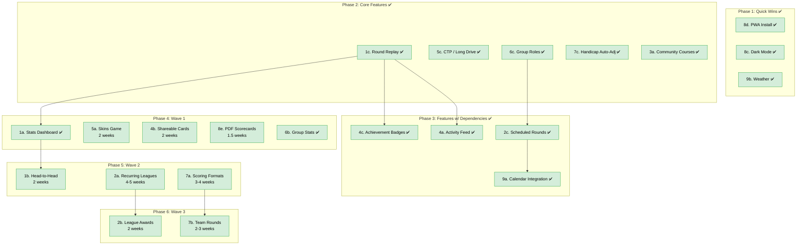
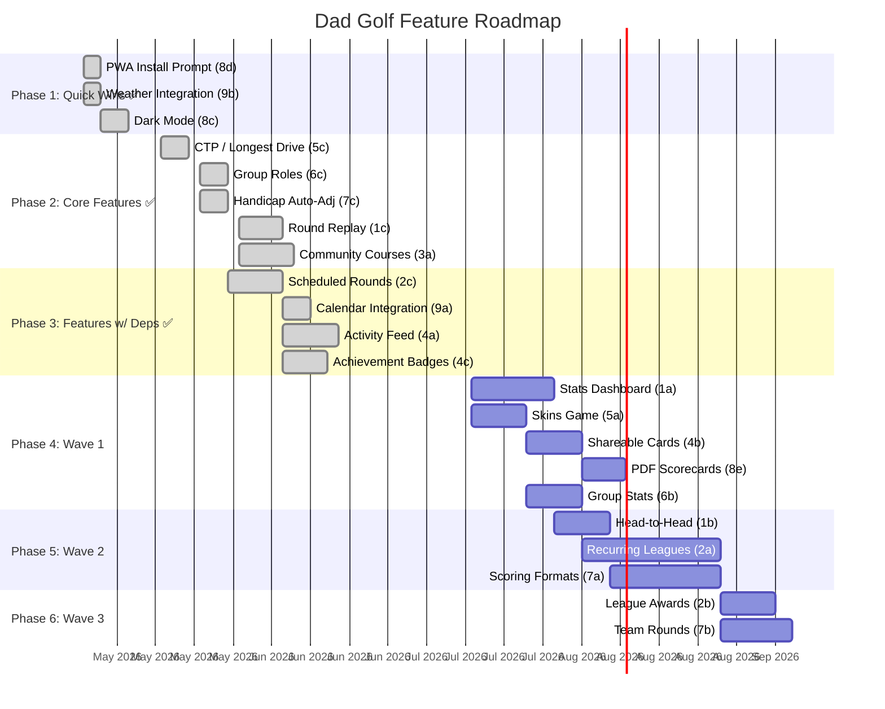

# Dad Golf Roadmap

Dependency graph and estimated durations for all planned features.
Estimates assume a solo developer working part-time (~15-20 hrs/week).

All features are free — Dad Golf is a free app.

---

## Dependency Graph



**Legend:** Green = FREE (all features)

---

## Gantt Timeline



---

## Phase Breakdown

### Phase 1: Quick Wins ✅

| Feature                 | Duration | Depends On | Notes      |
| ----------------------- | -------- | ---------- | ---------- |
| 8d. PWA Install Prompt  | 3 days   | —          | ✅ Shipped |
| 9b. Weather Integration | 3 days   | —          | ✅ Shipped |
| 8c. Dark Mode           | 1 week   | —          | ✅ Shipped |

**Phase complete.**

---

### Phase 2: Core Features ✅

| Feature                 | Duration  | Depends On | Notes                                                            |
| ----------------------- | --------- | ---------- | ---------------------------------------------------------------- |
| 5c. CTP / Longest Drive | 1 week    | —          | ✅ Shipped                                                       |
| 6c. Group Roles         | 1 week    | —          | ✅ Shipped (admin/member, simplified)                            |
| 7c. Handicap Auto-Adj   | 1 week    | —          | ✅ Shipped — GA/WHS rolling calc, auto-updates on round complete |
| 1c. Round Replay        | 1.5 weeks | —          | ✅ Shipped — scorecard, progression chart, per-player stats      |
| 3a. Community Courses   | 2 weeks   | —          | ✅ Shipped — shared courses, reviews, ratings, reports           |

**Phase complete.**

---

### Phase 3: Features with Dependencies ✅

| Feature                  | Duration  | Depends On | Notes                                                                 |
| ------------------------ | --------- | ---------- | --------------------------------------------------------------------- |
| 2c. Scheduled Rounds     | 2 weeks   | 6c         | ✅ Shipped — date/time/course, RSVP, auto-start with accepted players |
| 9a. Calendar Integration | 1 week    | 2c         | ✅ Shipped — .ics export, Google Calendar OAuth sync, iCal feed URL   |
| 4a. Activity Feed        | 2 weeks   | 1c         | ✅ Shipped — Group activity feed with likes/comments, privacy controls, 7 event types |
| 4c. Achievement Badges   | 1.5 weeks | 1c         | ✅ Shipped — 12 badges across 4 categories, public user profiles, auto-evaluation      |

**All shipped!**

---

### Phase 4: Wave 1

| Feature             | Duration  | Depends On | Notes                                   |
| ------------------- | --------- | ---------- | --------------------------------------- |
| 1a. Stats Dashboard | 2-3 weeks | 1c         | ✅ Shipped — Stableford/Strokes toggle, overview cards, trend chart, par breakdown, course stats |
| 5a. Skins Game      | 2 weeks   | —          | Parallel scoring layer on rounds        |
| 4b. Shareable Cards | 2 weeks   | —          | Server-side image gen (canvas/SVG)      |
| 8e. PDF Scorecards  | 1.5 weeks | —          | PDF generation (pdfkit or similar)      |
| 6b. Group Stats     | 2 weeks   | —          | ✅ Shipped — All-time leaderboard, records, member breakdown, course stats |

**Phase total: ~7 weeks** (some can run in parallel)

---

### Phase 5: Wave 2

| Feature               | Duration  | Depends On | Notes                                |
| --------------------- | --------- | ---------- | ------------------------------------ |
| 1b. Head-to-Head      | 2 weeks   | 1a         | Extends stats infra with comparisons |
| 2a. Recurring Leagues | 4-5 weeks | —          | New data models, standings, seasons  |
| 7a. Scoring Formats   | 3-4 weeks | —          | Stroke, Ambrose, best ball, par comp |

**Phase total: ~9 weeks** (parallel tracks possible)

The big features. Leagues (2a) is the highest-effort item on the entire
roadmap but also the stickiest feature.

---

### Phase 6: Wave 3

| Feature           | Duration  | Depends On | Notes                                  |
| ----------------- | --------- | ---------- | -------------------------------------- |
| 2b. League Awards | 2 weeks   | 2a         | Auto-generated awards from league data |
| 7b. Team Rounds   | 2-3 weeks | 7a         | Team assignment + combined scoring     |

**Phase total: ~4 weeks** (can overlap with late Phase 5)

Extensions of Phase 5 features. Only buildable once the parent features
are stable.

---

## Critical Path

The longest dependency chain determines the earliest possible completion:

```
Stats Dashboard (3w) → Head-to-Head (2w)
Recurring Leagues (5w) → League Awards (2w)    ← longest
Scoring Formats (4w) → Team Rounds (3w)
```

**Longest chain: Leagues → Awards = ~7 weeks**

Including shipped features (Phases 1-3), the remaining features (Phases 4-6)
could ship over approximately **5-6 months** at part-time pace.

---

## Estimated Total Effort

| Category           | Features                | Est. Weeks      |
| ------------------ | ----------------------- | --------------- |
| Shipped            | 16 features ✅          | ~0 weeks        |
| Remaining          | 8 features              | ~19 weeks       |
| **Total remaining**| **8 features**          | **~19 weeks**   |

**Shipped so far:** 8c Dark Mode, 8d PWA Install, 9b Weather, 5c CTP/Longest Drive, 6c Group Roles, 7c Handicap Auto-Adj, 1c Round Replay, 3a Community Courses, 2c Scheduled Rounds, 9a Calendar Integration, 4a Activity Feed, 4c Achievement Badges, 1a Stats Dashboard, 6b Group Stats (plus location autocomplete and course reviews).

At part-time pace (~15-20 hrs/week), remaining work is roughly **5-6 months** of
calendar time with some parallelism.
